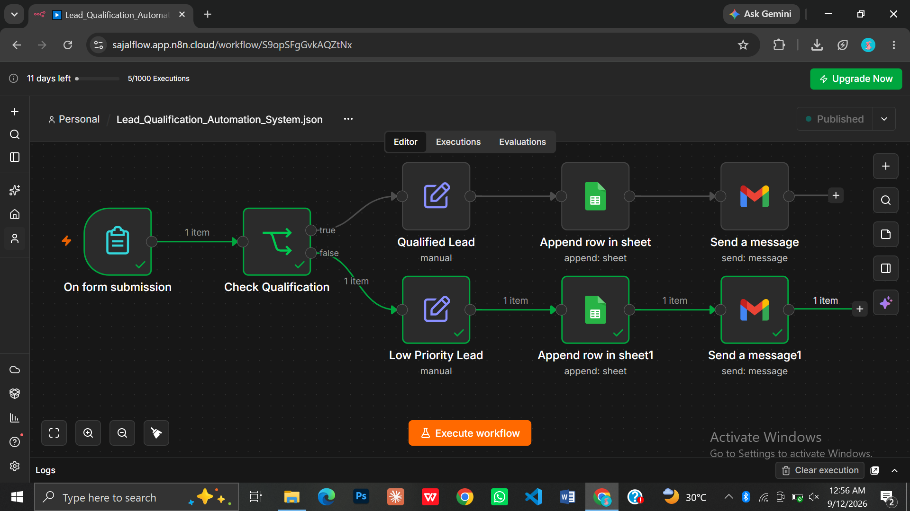

# n8n Lead Qualification & Notification Automation

An automated lead management workflow built with n8n that collects lead information, evaluates lead quality, stores leads in Google Sheets, and sends automated Gmail notifications.

## Overview

This project demonstrates a simple lead qualification and notification workflow using n8n.

When a lead submits the form, the workflow checks the lead information and separates the lead into two paths:

- Qualified Lead
- Low Priority Lead

The lead information is then stored in Google Sheets and an automated email notification is sent through Gmail.

## Workflow

Form Submission
↓
Check Qualification
↓
├── Qualified Lead → Google Sheets → Gmail Notification
│
└── Low Priority Lead → Google Sheets → Gmail Notification

## Key Features

- Lead information collection through an n8n form
- Lead qualification using conditional logic
- Separate handling for qualified and low-priority leads
- Automatic Google Sheets record creation
- Automated Gmail notifications
- Workflow-based lead management

## Technologies Used

- n8n
- Webhooks / Form Trigger
- Google Sheets
- Gmail
- Conditional Logic
- Workflow Automation

## Workflow Structure

### 1. Form Submission
Collects the lead information submitted through the form.

### 2. Check Qualification
Evaluates the submitted lead information and routes the lead based on the qualification condition.

### 3. Qualified Lead
Qualified leads are processed through the qualified-lead path, recorded in Google Sheets, and followed by an automated Gmail notification.

### 4. Low Priority Lead
Leads that do not meet the qualification condition are processed through the low-priority path, recorded in Google Sheets, and followed by an automated Gmail notification.

## Project Files

- `workflow/` — Contains the exported n8n workflow JSON.
- `screenshots/` — Contains workflow execution and output screenshots.
- `README.md` — Project documentation.

## Screenshots

Project workflow and execution evidence are available in the `screenshots/` folder.

## How to Use

1. Import the workflow JSON file into n8n.
2. Configure your Google Sheets credentials.
3. Configure your Gmail credentials.
4. Review the qualification condition.
5. Test the workflow using the form.
6. Verify the lead record in Google Sheets.
7. Verify the notification email in Gmail.

## Notes

This project was developed as a practical automation project to demonstrate workflow design, conditional processing, data storage, and automated notifications using n8n.

## Workflow

